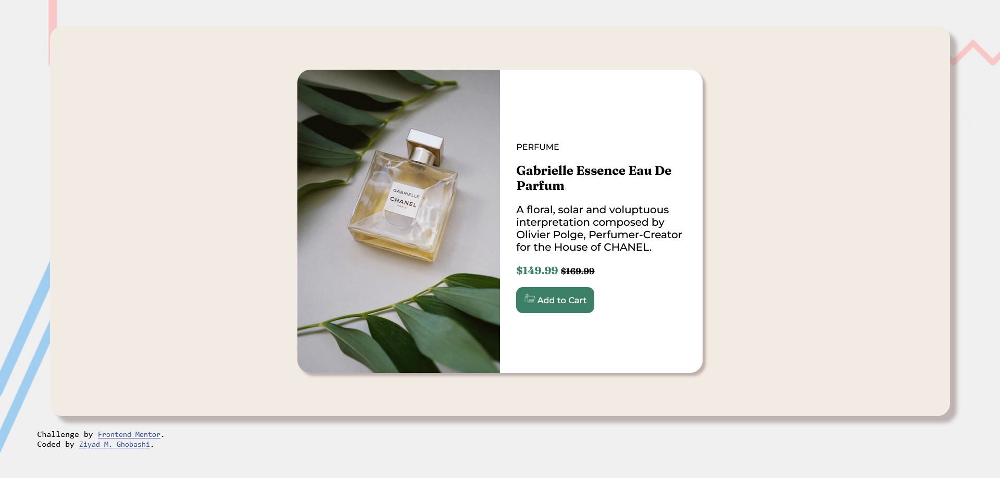
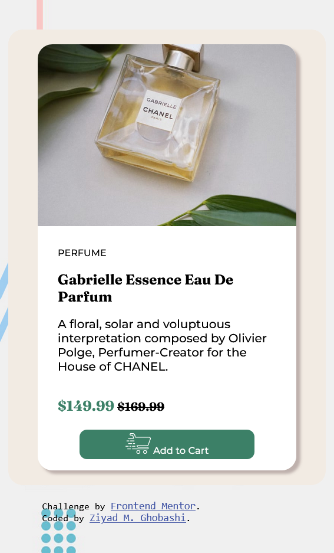
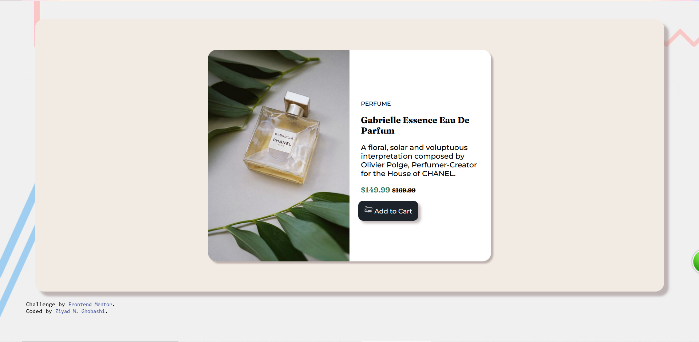

# Frontend Mentor - Product preview card component solution

This is a solution to the [Product preview card component challenge on Frontend Mentor](https://www.frontendmentor.io/challenges/product-preview-card-component-GO7UmttRfa).

## Table of contents

- [Overview](#overview)
  - [The challenge](#the-challenge)
  - [Screenshots](#screenshots)
  - [Links](#links)
- [My process](#my-process)
  - [Built with](#built-with)
  - [What I learned](#what-i-learned)
  - [Continued development](#continued-development)
  - [Useful resources](#useful-resources)
- [Author](#author)

## Overview

### The challenge

Users should be able to:

- View the optimal layout depending on their device's screen size
- See hover and focus states for interactive elements

### Screenshots

### Links

- Solution URL:(https://www.frontendmentor.io/solutions/product-preview-card-component-challenge-using-only-html-and-css-k5YrbPwRnD)
- Live Site URL:(https://ziy-eg.github.io/Front-end-mentor-challenge-01/)

## My process

### Built with

- HTML5 markup
- CSS custom properties
- Adobe Photoshop (for creating a new background)
- Adobe Illustrator (for creating vectors)
- Using **Visual Studio Code** as an editor

### What I learned

- I learned alot about responsive designs and which element to use where.(still a working progress)

### Continued development

- responsive designs
- webkit (which I know nothing about how to use it so far...)

### Useful resources

- (https://developer.mozilla.org/en-US/) simple examples.
- (https://www.freecodecamp.org/learn/) FREE Responsive Web Design Course and MUCH more.

## Author

- FreeCodeCamp - [Ziyad Ghobashi](https://www.freecodecamp.org/ziy_ghobashi)
- Frontend Mentor - [@ziy-eg](https://www.frontendmentor.io/profile/ziy-eg)
- Github - [Ziy Ghobashi](https://github.com/ziy-eg)
